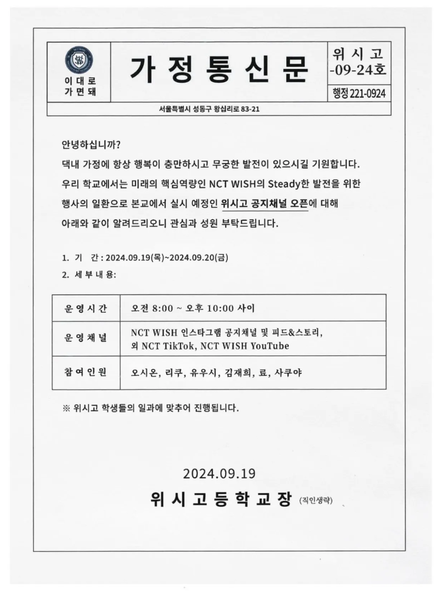
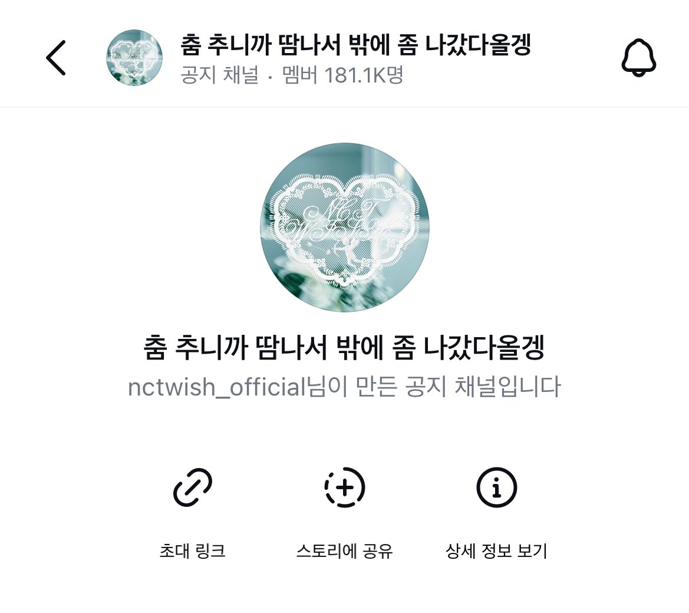
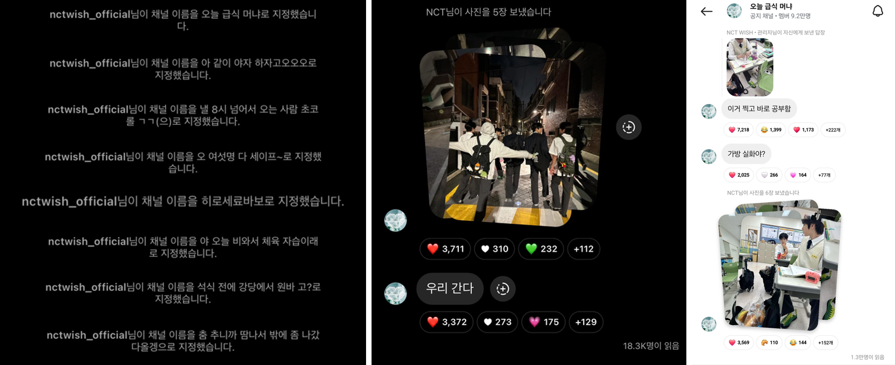
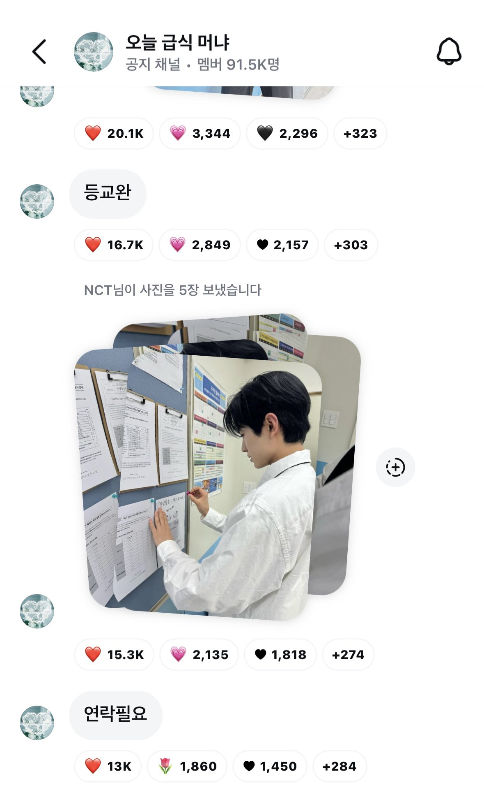
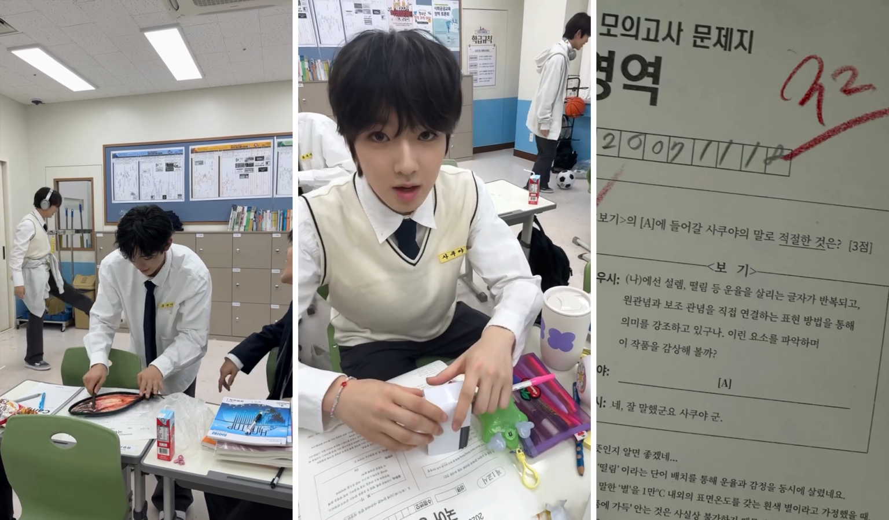
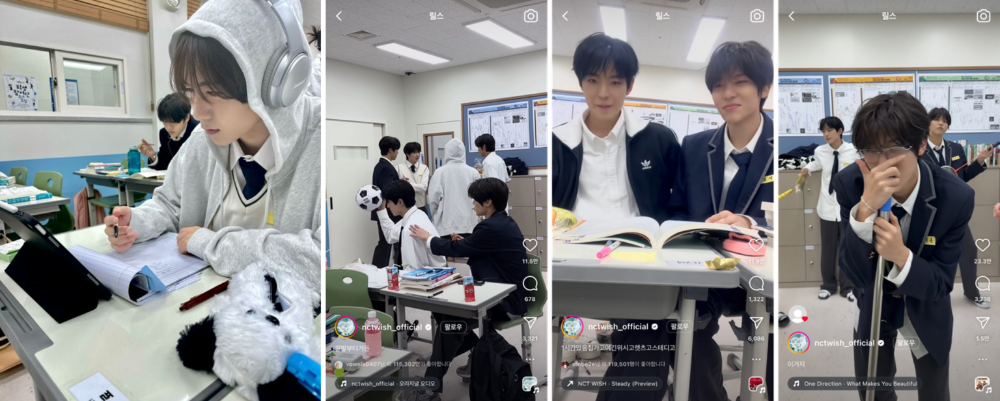
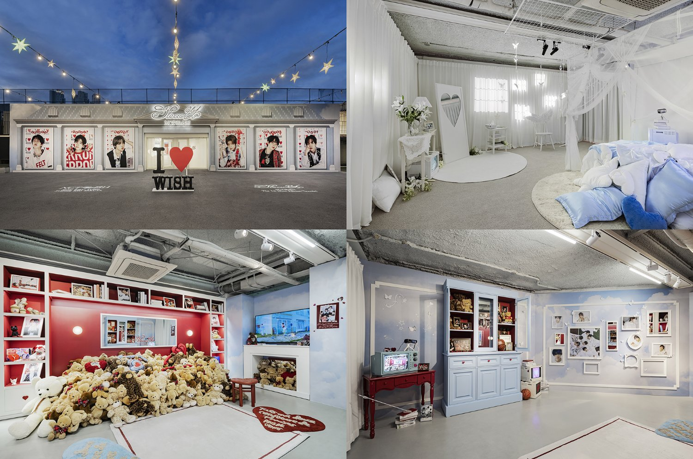

# 팬은 기다림도 소비한다

**앨범을 기다리는 여정이 팬 경험이 되는 법**

K팝에서 앨범은 더 이상 '발매일'만 중요한 게 아닙니다.

**앨범이 나오기 전의 모든 시간**,

그 기다림조차도 팬에게는 하나의 **설계된 경험**이 됩니다.

📌 그리고 이 '설렘의 시간'이 실제 앨범 구매로 이어지고 있습니다.

---

### 📸 앨범 발매 이전 = 팬덤 몰입의 시간

앨범 출시 전 몇 주 간, 팬들은 다음과 같은 콘텐츠를 접합니다:

- 콘셉트 포토 & 트레일러 영상
- 커버 아트, 샘플 구성품 공개
- 스케줄 타임라인 & 멤버별 비주얼 콘텐츠
- 선공개곡, 쇼케이스, 테마 홈페이지 등

이 모든 것은 단순한 '티저'가 아니라, 팬의 상상과 감정을 설계하는 **하나의 서사적 여정**입니다.

---

## 🌈 NCT WISH 사례: 기다림을 설계하는 브랜드

NCT WISH는 이 '기대의 경험'을 전략적으로 활용한 대표 사례입니다.

그들은 '기다림'조차 **설계 가능한 팬 경험 자산**으로 바꾸는 방법을 보여줬습니다.

### 🎯 기획 의도:

**NCT WISH는 데뷔부터 "소원을 이뤄주는 큐피드"라는 세계관을 바탕으로** 팬과의 감정적 연결을 중요하게 생각했습니다.

- 첫 싱글 *Songbird*: "음악으로 팬의 소원을 응원한다"
- 첫 미니 앨범 *Steady*: "꿈을 향해 나아가는 청춘의 이야기"

두 앨범 모두 **사전 프로모션을 통해 세계관-스토리-디자인-팬 경험을 일관되게 연결**해 팬이 "그 이야기 속의 일부"가 되도록 설계했습니다.

### 📦 사례 (1) [『Songbird』 활동](https://gogumafarm.kr/%ec%9a%94%ec%a6%98%ec%9d%80-%ec%bb%b4%eb%b0%b1-%ed%94%84%eb%a1%9c%eb%aa%a8%ec%85%98-%ed%99%88%ed%8e%98%ec%9d%b4%ec%a7%80%ea%b0%80-%ec%9c%a0%ed%96%89-%ec%95%a8%eb%b2%94-%ec%bd%98%ec%85%89%ed%8a%b8/): 팬의 소원을 이뤄주는 경험 마케팅

⭐ **목적과 전략**:

**팬들이 실제로 소원을 보내고 멤버들이 이뤄준다**는 몰입형 프로모션으로, 팬들의 자발적인 참여와 공감을 극대화했습니다. 

⭐ **실행 방식**:

- 트레일러 영상에 QR코드 숨기기 → 팬들이 찾아내 온라인으로 바이럴되었습니다.

- [컴백 프로모션 홈페이지](https://songbird-express.com/)를 개설, 팬들이 직접 '소원 레터'를 쓰고 원하는 멤버에게 보낼 수 있도록 설계하였습니다.

- 선정된 팬의 소원은 실제로 멤버가 현실에서 실현하며, 이를 통해 팬이 세계관의 일부가 되는 경험을 제공했습니다.
- 서울 도심에서 'Songbird Express' 트럭 운영, 미니 팝업에서는 'Songbird Balloon Bag'을 나누어주며 오프라인으로 경험을 확장했습니다.

⭐ **팬 반응**:

"나의 소원이 진짜 이뤄진다면?"이라는 설렘과 몰입감 극대화해 팬 커뮤니티에서 자발적인 참여와 공유가 폭발적으로 증가했습니다.

### 🏫 사례 (2) 『Steady』 활동 – '[위시고등학교](https://gogumafarm.kr/%ED%8C%AC%EB%8D%A4%EC%9D%98-%EA%B3%BC%EB%AA%B0%EC%9E%85%EC%9D%84-%EB%B6%80%EB%A5%B8-nct-wish%EC%9D%98-%EC%BB%B4%EB%B0%B1-%EB%A7%88%EC%BC%80%ED%8C%85-%EC%9D%B8%EC%8A%A4%ED%83%80%EA%B7%B8%EB%9E%A8/)'에서 함께 생활하기

⭐ **목적과 전략**:

팬들이 NCT WISH와 함께 '위시고등학교'에서의 가상의 학교생활을 체험하며 멤버들과 실제 친구가 되는 듯한 경험을 유도했습니다.

⭐ **실행 방식:**

- 공식 SNS 채널에서 프로모션의 시작을 알리는 공지를 '가정통신문'의 형태로 업로드하였습니다.
    
    
    
- 인스타그램 공지 채널에서 '위시고등학교' 입학 컨셉으로 활동 스케쥴을 멤버들에게 직접 받는 DM처럼 전달했습니다.

- 시간대별로 공지 채널 이름을 변경("점심시간에는 '오늘 급식 머냐' 같은 이름을, 저녁시간에는 '아 같이 야자 하자고오오', '낼 8시 넘어서 오는 사람 초코롤 ㄱㄱ' 등으로 변경)하고 사진을 올리면서 팬들과 실시간 소통을 강화했습니다.
    
    
    

- 특히 공지 채널에 사진과 함께 전송된 '헐 맞다 수행'이라는 이미지를 유심히 살펴보면 '2024학년도 2학기 Steady 틱톡 수행평가', 'NCT WISH 학사일정 안내' 등 학교 컨셉을 재치있게 녹여낸 유인물을 확인할 수 있습니다. 이렇듯 디테일을 잘 녹여 팬덤의 긍정적인 반응을 끌어낼 수 있었습니다.
    
    
    
- 고등학생 컨셉을 더욱 강화하기 위해 '[**고등어 손질하는 방법**](https://www.youtube.com/watch?v=wyIYbKTRkg8)'이라는 제목으로 화제가 되었던 학생의 영상을 패러디하고, [**'너 몇 접시 먹을 거야!!' 챌린지**](https://gogumafarm.kr/%eb%84%88-%ec%98%a4%eb%8a%98-%ec%95%84%ed%8b%b0%ed%81%b4-%eb%aa%87-%ea%b0%9c-%eb%b3%bc-%ea%b1%b0%ec%95%bc-%eb%94%b0%eb%9d%bc%ed%95%98%ea%b8%b0-%ec%89%ac%ec%9a%b4-%ec%88%8f%ed%8f%bc-%ec%b1%8c/)를 녹여낸 릴스를 업로드하는 등으로 화제성을 이끌어냈습니다.
    
    
    
    인스타그램 @nctwish_official 
    
    
    
    인스타그램 @nctwish_official 
    
- [**NCT WISH의 공지 채널 운영이 끝난 후 업로드된 게시글**](https://www.instagram.com/p/DAI9beES0-N/?img_index=1)에는 '하교하는 컨셉'의 이미지를 포함, 마지막까지 컨셉에 충실한 프로모션을 했습니다.
    
- [팝업스토어 『Let's Go Steady』](https://www.smentertainment.com/newsroom/nct-wish-%EC%B2%AB-%EB%AF%B8%EB%8B%88%EC%95%A8%EB%B2%94-steady%EB%A5%BC-%EB%8B%A4%EC%B1%84%EB%A1%AD%EA%B2%8C-%EC%A6%90%EA%B8%B0%EB%8A%94-%EB%B2%95/) 를 운영해, 앨범 세계관을 공간으로 구현하여 팬들이 오프라인에서 몰입 경험을 지속하도록 유도했습니다.
    
    
    

## 📷 + 앨범 자체가 팬 경험의 연장: 스토리를 담은 패키지

- NCT WISH의 앨범 『Steady (Wichu's Memory ver.)』는 '위츄'라는 마스코트의 기억을 담는 카메라 형태의 키링으로 제작되었습니다.
- 팬들은 키링의 렌즈를 통해 멤버들의 학교 생활 사진을 직접 넘겨볼 수 있어, 실제 추억을 간직하는 듯한 몰입형 경험을 할 수 있도록 설계하였습니다.

---

## 📈 전략의 실제 성과: 몰입 경험이 실적을 견인하다

- 『Steady』 앨범은 선주문량 80만 장으로, 역대 데뷔 아티스트 최고 기록을 달성했습니다. 이는 전작 『Songbird』 대비 초동 판매량 약 47.28% 증가한 기록입니다.
- 중국 등 글로벌 주요 음원차트에서도 1위를 기록했습니다.
- 『Steady』 팝업스토어는 오픈 기간 내내 긴 대기줄로 폭발적 인기를 증명, 하루 평균 1,000명 이상의 대기줄을 기록하며 매일 조기 마감되었습니다.

이 결과들은 **팬의 감정 몰입을 설계하는 마케팅 전략**이 단순한 재미를 넘어, 실제 구매로 전환된다는 증거가 되었습니다.

---

### 💡 **비즈니스 인사이트: 팬 경험은 '기대의 설계'로 완성된다**

📌 **'기대'는 제품보다 먼저 팔 수 있는 강력한 자산이다**

제품이 출시되기 전 팬들이 그 시간을 어떻게 보내는지 설계하고 관리해야 합니다. 팬의 기다림을 의미 있고 흥미롭게 구성하는 것이 핵심 경쟁력입니다. 

📌 **'세계관 기반의 경험 설계'는 그 자체로 마케팅이다**

일관된 세계관과 톤앤매너를 유지하며 팬들이 브랜드 스토리에 몰입할 수 있도록 유도할 때,

팬의 감정적 연결과 장기적 충성도가 형성됩니다.

📌 **디자인은 팬 경험의 출발점이자 전체 경험의 톤을 정의한다**

디자인은 단순히 시각적인 요소가 아니라 팬 경험의 전체적인 정서와 분위기를 규정하고

팬들이 브랜드의 세계관과 경험을 직관적으로 받아들이게 하는 도구입니다.

📌 **콘텐츠는 단순 홍보가 아닌 '팬의 감정적 아카이빙'이어야 한다**

콘텐츠는 단순히 제품을 홍보하는 도구가 아니라, 팬의 감정을 저장하고 공유하며 오래 기억될 수 있도록 설계되어야 합니다. 

팬이 스스로 찾아보고 공유하고 싶은 콘텐츠를 만들어야만 앨범과 브랜드의 가치는 지속됩니다.

🗣️ 기다림은 낭비가 아닙니다.

설계된 기다림은 팬 경험을 극대화하는 가장 강력한 비즈니스 전략입니다.